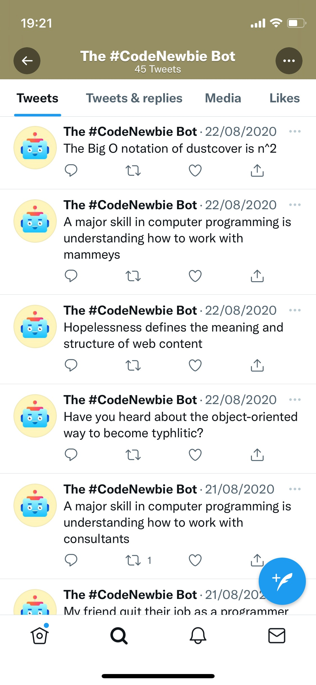

# Twitter Bot

## General Information

To keep the programming community engaged, I built a Twitter bot. It likes 400 tweets daily under #100DaysOfCode and #CodeNewbie. It also shares coding jokes (hopefully funny!). The bot, powered by Tweepy, automatically likes tweets, follows back, and tweets jokes using AWS Lambda and CloudWatch Events. Please note: My AWS subscription has lapsed, rendering this bot inactive.

For jokes, I crafted sentences with a missing word, filled in by the Random Word API. Then, using NLTK, the word's part of speech is tagged, ensuring it fits grammatically. Let's keep the coding journey fun and lively! 😂

## Technologies
- Python 3
- Tweepy
- random
- requests
- NLTK (Natural Language Toolkit)
- AWS Lambda

## Preview

## Setup
`pip install tweepy && pip install random && pip install requests && pip install nltk`

## Inspiration
- [Programmer puns](https://punstoppable.com/Programmer-puns)
- [Programming jokes](http://www.devtopics.com/best-programming-jokes/)
