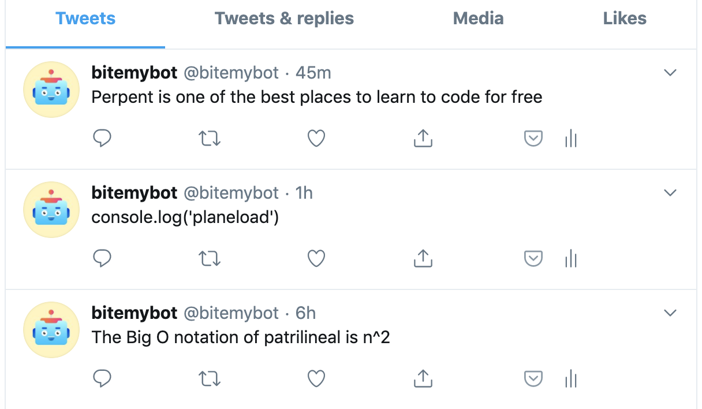

# Twitter Bot

## General info
To encourage people to continue sharing their programming journey online, I developed a Twitter bot that likes 400 tweets a day under the following hashtags: **#100DaysOfCode** and **#CodeNewbie**. The bots also tweets a coding-related jokes that are meant to be funny; I leave it to your judgement.

## Technologies
- Python 3
- Tweepy
- random
- requests
- NLTK (The Natural Language Toolkit)

## Preview
Click [here](https://twitter.com/bitemybot) to see this project in your browser.
  

## Setup
`pip install tweepy && pip install random && pip install requests && pip install nltk`

## How it works
The bot uses Tweepy to accomplish all of its functionalities – to find and like tweets containing certain hashtags and like them, to automatically follow back all users that follow the bot account and to publish tweets in the bots behalf. These functionalities are scheduled to repeat everyday at 4PM using AWS Lambda and CloudWatch Events.

To generate the funny tweet, I wrote several sentences with one word missing. This word is obtained from [Random word API](https://random-word-api.herokuapp.com/home) and then is semantically tagged (POS tagging) using the NLTK library which generates a label that corresponds to its part of speech. The word is then placed into sentences accordingly, obeying to the rules of semantics. This functionality is not yet live.

## Inspiration
- [Programmer puns](https://punstoppable.com/Programmer-puns)
- [Programming jokes](http://www.devtopics.com/best-programming-jokes/)
